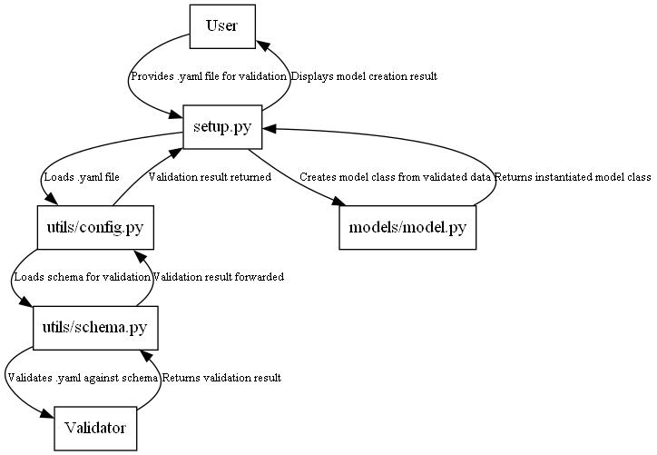

# IDR-IIsim
Repository with industry models tailored to the integration on large scale energy system models and circular economy assessment
<hr>

## 1. Data Model

This process defines how an industrial process method is represented as a data model (model.yaml), validated for correctness using a schema (schema.py), and then converted into an executable Python script (generated_script.py) that implements the operations described.

### Components of the Data Modelling
1. **Folder structure**: The tool is designed to be flexible, enabling users to define their own data models. The folder structure is organized hierarchically: first, the industry is defined, followed by the process, and finally the method. This structure is illustrated in the following figure.

            ├── idr_iisim
                  ├── industry
                        ├── processA
                              ├── method1
                                    ├── model.yaml
                                    ├── model.png
                                    ├── generated_model.py
                              ├── method2
                                    ├── model.yaml
                                    ├── model.png
                                    ├── generated_model.py
                                    .
                                    .
                                    .

  
2. **Model File (model.yaml)**: A YAML file that describes the industrial method. It contains the following key sections:<br><br>
     - **Constants**: Predefined values used in the operations.
     - **Inputs**: External parameters required for the method.
     - **Outputs**: Results calculated by the method.
     - **Operations**: Mathematical or logical expressions that define how the outputs are derived from constants and inputs.

      <br>Example Structure of model.yaml:
            
        name: method2
        id: industry-process_a-method2
        description: A description
        version: 1.0.0
        debug: false

        constants:
          - name: alpha
            label: alpha
            description: constant1 description
            citation: test
            source: https://www.google.com
            value: 0.25
            # units: km
        # more constants can be defined here

        inputs:
          - name: a0
            label: a0
            description: a0 description
            value: [20, 25]
            # units: m
            from: null  # industry-process_name-method_name
        # more inputs can be defined here

        # Expected number of outputs. In this case: 1
        # The formula can use other outputs as inputs
        outputs:
          - name: Ao
            label: Ao
            operation: a0 - b0 # sympify valid expression
            args:
              - name: a0
                type: inputs
              - name: b0
                type: inputs
            description: output1 description
            value: null
        # more outputs can be defined here


See the example of the modelling of a method to understand how the data is structured: [model.py](idr_iisim/industry/processA/method1/model.yaml)

3. **Schema File**: The file: [schema.yaml](config/schema.yaml), is a schema that defines the structure or blueprint that describe the expected structure, types, and constraints of the data in the YAML file ).  This schema (.yaml) is used by [schema.py](idr_iisim/utils/schema.py) for validating data to ensure data integrity by verifying its format, types, and values. And to catch errors early by rejecting invalid data. Validation checks that:
   - All constants have a name, value, and description.
   - All inputs have a name, type, and description.
   - All outputs have a valid expression.
   - No duplicate names exist across constants, inputs, and outputs.
  
   <br>A schema in Python is a powerful tool for defining and enforcing data structure rules, making applications more robust and error-resistant. 
   <br>

4. **Generated Method Script**: A Model class is generated when [config.py](idr_iisim/models/model.py)) is executed. This class includes the method: *script_generator()*, which dynamically generates a Python script based on the model constants, inputs, outputs and operations defined in the data model (e.g., [model.yaml](idr_iisim/industry/processA/method1/model.yaml)).
<br>

5. **Process Workflow**
  

  This UML sequence diagram illustrates the process of validating a .yaml file and generating a model class in a Python application.

  Key Steps:
   - A user provides a .yaml file to setup.py.
   - setup.py interacts with config.py to load the file and uses schema.py to validate it against a predefined schema.
   - The validation process involves verifying the .yaml file’s structure and content through a validator.
   - Once validated, setup.py calls model.py to create an instantiated model class from the validated data.
   - Finally, the model class is returned to setup.py, and the results are displayed to the user.
<br>
 
1. **Advantages**

<hr>

## 2. Execution
The tool can be executed by running the following commands:
```bash
# install dependencies
pip install -r requirements.txt

# run the tool
python setup.py
```

As a result of the execution, the tool will print the results in the console and will generate the model diagrams in the
method folders. The diagrams will be saved as `model.png`.

### 2.1 Entry point - workflow

This flowchart illustrates the execution process of setup.py in a Python-based application, detailing its interactions with key components and steps involved in configuring, validating, and running models.
Key Steps:

1. *Star*t: Execution begins with setup.py.
2. *Call main()*: The main function initializes the setup process.
3. *Initialization (init())*: Sets up the environment and pre-requisites for execution.
4. *Load Configuration*: Reads the config.yaml file to fetch configuration data using config.py.
5. *Validate Schema*: Validates the configuration and .yaml files using schema.py to ensure correctness.
6. *Scan Industry Directory*: Scans the industry/ directory for model files.
7. *Discover and Register Models*: Discovers available models and registers them using models_dict.py.
8. *Generate Execution Queue*: Creates an execution order for models using execution.py.
9. *Execute Models*: Runs the model calculations using model.py.
10. *Log Results*: Logs the results or any errors using logger.py.
11. *End Execution*: Marks the completion of the execution process.

## Next steps
- [x] Add funtion to dinamiclly generate the model script.
- [ ] Add support for vectorized outputs. For the moment, the tool only supports scalar values.
- [ ] Add support for recursive operations.
- [ ] Improve diagrams visualization.
- [ ] Add support for debug mode.
- [ ] Add a results folder where the results of the execution will be saved. It might be necessary to include a new
      section in the `model.yaml` file to define the values that are considered as results.