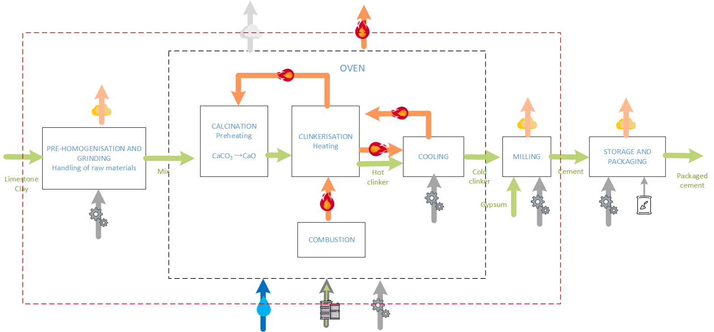
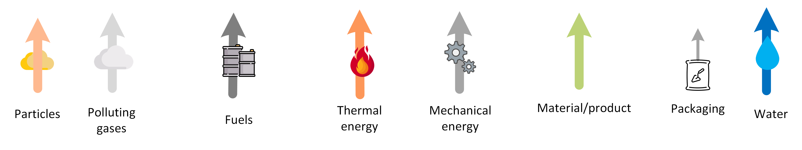

# **CEMENT PRODUCTION**

# 1. Introduction

Cement, a fundamental material in modern construction, has a rich and extensive history dating back thousands of years. Since its first use in ancient times, it has evolved significantly and has played a major role in the development of architecture and civil engineering because of its unique properties and its ability to form durable and resistant structures. Today, cement production methods use advanced machinery to produce cement in massive quantities and of high quality.

Despite technological advances in the cement industry, it is still a highly polluting process, especially in terms of CO2 emissions and other polluting particles with harmful effects on health, consuming a lot of water and energy \[1\].

# 2. Overview of the cement production

Although there are several types of cement, and different production processes, most of them follow the model shown in Figure 1, with the legends described in Figure 2\.

The storage and distribution phase is very different from one plant to another as it depends mainly on the customer, and is therefore excluded from this model.

The three phases to be modelled are therefore the pre-homogenisation, where the raw material is crushed and mixed, the oven, where the main chemical reactions take place, and finally the milling phase, where the necessary components are added to obtain the precise product desired.

Figure 1\. Schematic representation of a generic cement production process

Figure 2\. Legends of process symbols

# 3. Detailed description of the cement production

The model developed corresponds to the red rectangle in Figure 1, leaving out of this study the storage and packaging phases. Each block represents a sub-process, and although some material and energy flows are internal to the plant itself, the data model allows for the possibility of recirculation loops being diverted to the outside. Therefore, each sub-process is defined independently, without considering the internal loops.

The model presented here corresponds to the production of “n” tonnes of cement.

The symbol \* means product.

The numerical values of inputs and outputs presented in the tables have been calculated with n=1.

## 3.1 Pre-homogenization and grinding: handling of raw materials (Subproceso 1)

In the pre-homogenization stage, both clay and limestone are stored in an enclosed room. These materials are arranged in uniform layers which are selected in a controlled manner to ensure a homogeneous and consistent mix.

The pre-homogenised materials are then transported to the mills via conveyor belts to be crushed.

#### Energy consumption

This phase requires mechanical energy, which is usually produced by electromechanical drives, and Therefore electricity consumption is the reference data. From \[2\] electrical energy consumption per ton of cement is  32.2 kW·h=115.92 MJ.

The efficiency of the actuators and the installation in general can range from 70 to 85%.

#### Raw materials and emissions

The main sources of information for the determination of the materials needed are  \[3\] and \[4\] and the data related to the shrinkage comes from \[5\].

Crushing and mixing the raw material produces small particles, dust, which inevitably constitute emissions into air and a small loss of material.

### Variables

| Name | Label | Unit | Value | Equation/From |
| :---- | :---- | :---- | :---- | :---- |
| limestone\_demand | Limestone | kg | 1035 |  |
| clay\_demand | Clay | kg  | 375 |  |
| mechanical\_energy | Mechanical energy | MJ | 115.92 |  |
| PM10\_emission\_pre | PM10 emission | kg | 14.1  | (limestone\_losses \* limestone\_demand) \+ (Clay\_losses \* Clay\_demand) |
| raw\_mix | Mix | kg | 1395.9 | limestone\_demand \+ Clay\_demand \- PM10\_emission\_pre |

### Parameters

| Name | Label | Unit | Value | Equation/From |
| :---- | :---- | :---- | :---- | :---- |
| limestone\_losses | Limestone losses | p.u\* | 0.01 |  |
| clay\_losses | Clay losses | p.u\* | 0.01 |  |

_p.u.: per unit of product_

## 3.2 OVEN: Calcination, clinkerization, combustion, cooling (Subproceso 2)

Once the raw flour from the milling process enters the oven, there is a preheating phase and then a firing process begins. As it progresses through the oven, the temperature gradually increases until it reaches approximately 1,500°C, the raw materials are calcined in the presence of oxygen and a clinker is formed, which is a hard, solid substance.

The hot air generated during the cooling process is recycled back into the furnace to assist combustion. This contributes to improving the energy efficiency of the process, as it reduces the amount of energy needed to reach and maintain the high temperatures required in the furnace.

#### Energy Consumption

This phase requires mechanical energy, which is usually produced by electromechanical drives, and Therefore electricity consumption is the reference data. From \[2\] electrical energy consumption per ton of cement is  19.32 kW·h=69.552 MJ.

The heat required to produce one tonne of cement is 3.5 GJ \[6\]. This thermal energy comes from different fuels, including waste from other processes. The average value of fuels consumed in Spain in the period 2011-2015 per tonne of cement produced is taken from \[7\].

In addition, the nature of the fuel influences the characteristics of the product, so that, depending on the desired product, different fuels or fuel blends are used.

From the fuel consumption and heat generation data, it is deduced that the average heat capacity of the fuel is 26.93 MJ/kg. This seems realistic, as petroleum coke has between 29 and 35 MJ/kg.

In addition, the heat loss in the oven is about 18.71% \[6\].

#### Water consumption

Water is used to prepare the mixture to be transformed into a clinker and for the cooling sub-process. Water evaporates and comes out as steam. According to data from the Cema Foundation \[8\], water consumption per tonne of cement produced in Spain ranges between 200 and 250 litres.

#### Raw materials and emissions

The product emissions due to shrinkage are taken from \[5\].

CO2 emissions are obtained from \[9\].

### Variables

| Name | Label | Unit | Value | Equation/From |
| :---- | :---- | :---- | :---- | :---- |
| raw\_mix | Mix consumption | null | null | former process (Pre) output |
| PM10\_emission\_pre | PM10 emissions  | null | null | former process (Pre) output |
| fuel\_demand | Fuels | kg | 130 |  |
| mechanical\_energy\_oven | Mechanical energy | MJ | 69.55 |  |
| Water\_consumption | Water consumption | l | 222 |  |
| M10\_emission\_oven | PM10 emission | kg | 10.35 | PM10\_emission\_pre |
| CO2\_emissions\_oven | CO2 emission | kg | 309.30 | CO2\_emissions |
| heat\_losses | Heat losses | MJ | 655.02 | fuel\_demand  \* fuel\_HC \* energy\_losses |
| water\_demand\_oven | Water | kg | 222 | water\_consumption |
| clinker\_demand\_Oven | Clinker | kg | 865.46 | Raw\_Mix \* ( 1 \- Clinker\_losses ) |

### Parameters

| Name | Label | Unit | Value | Equation/From |
| :---- | :---- | :---- | :---- | :---- |
| clinker\_losses | Clinker losses | p.u. | 0.38 |  |
| fuel\_HC | Fuel HC | MJ/kg | 26.93 |  |
| energy\_losses | Energy losses | p.u. | 0.19 |  |
| water\_demand | Water | L | 222 |  |
| CO2\_emissions | CO2 | kg | 309.30 |  |

_p.u.: per unit of product_

## 3.3 Milling (Subproceso 3)

After calcination, the cooled clinker is mixed with additives, in the most common case gypsum is added. It is ground into an extremely fine powder: cement.

#### Energy Consumption

This phase requires mechanical energy, which is usually produced by electromechanical drives, and Therefore electricity consumption is the reference data. From \[2\] electrical energy consumption per ton of cement is  37.72 kW·h=135.792 MJ.

According to the UNE EN 197 standard \[10\], between 3 and 5% gypsum is added (depending on the characteristics of the clinker).

This phase includes the electrical energy consumed in the handling and packaging phases, a process that has been eliminated from the analysis, but which is practically negligible.

This phase includes the electrical energy consumed in the handling and packaging phases, a process that has been eliminated from the analysis, but which is practically negligible.

### Variables

| Name | Label | UNIT | VALUE | EQUATION/From |
| :---- | :---- | :---- | :---- | :---- |
| gypsum | Gypsum | kg | 34.62 |  |
| mechanical\_energy\_milling | Mechanical energy | MJ | 135.79 |  |
| cement\_emission | Cement air emissions | kg | 10 | conversion\_factor \* cement\_losses |
| gypsum\_losses\_milling | gypsum\_losses | kg | 1.38 | gypsum \* gypsum\_losses |

### Parameters

| Name | Label | UNIT | VALUE | EQUATION/From |
| :---- | :---- | :---- | :---- | :---- |
| cement\_losses | Cement losses | p.u. | 0.01 |  |
| gypsum\_losses | Gypsum | p.u. | 0.04 |  |
| conversion\_factor | Tons | kg | 1000 |  |

_p.u.: per unit of product_

# 4. Cement production process (metafile)

When treating all the boxes as a unified process, the resulting output is as follows:

| Name | Label | UNIT | VALUE | EQUATION/From |
| :---- | :---- | :---- | :---- | :---- |
| PM10\_emission\_pre | PM10 emissions | null | null | Output process Pre |
| PM10\_emission\_oven | PM10 emissions | null | null | Output Process Oven |
| cement\_emission | Cement air emission | null | null | Output process Milling |
| CO2\_emissions\_oven | CO2 emissions | null | null | Output process Oven |
| heat\_losses | Heat Losses | null | null | Output process Oven |
| water\_consumption | Water consumption | null | null | Output process Oven |
| limestone\_overall\_demand | Limestone demand | null | null | Output process Pre |
| clay\_overall\_demand | Clay demand | null | null | Output process Pre |
| gypsum\_losses\_milling | gypsum losses | null | null | Output process Milling |
| mechanical\_energy\_cement | Mechanical Energy | null | null | mechanical\_energy\_pre \+ mechanical\_energy\_oven \+ mechanical\_energy\_milling |
| CO2\_overall\_emission | CO2 emissions | null | null | CO2\_emissions\_oven |
| heat\_overall\_losses | Heat Losses | null | null | heat\_losses |
| water\_overall\_demand | Water consumption | null | null | water\_demand\_oven |
| PM10\_overall\_emissio | PM10 emissions | null | null | PM10\_emission\_pre \+ PM10\_emission\_oven \+ cement\_emission |
| fuel\_overall\_demand | Fuel consumption | null | null | fuel\_demand\_oven |
| gympsum\_overall\_losses | gypsum losses | null | null | gypsum\_losses\_milling |

### Parameters

| Name | Label | UNIT | VALUE | EQUATION/From |
| :---- | :---- | :---- | :---- | :---- |
| limestone\_demand\_pre | limestone demand | kg | 1035 | Process Pre |
| clay\_demand\_pre | clay demand | kg                               | 375 | Process Pre |
| Mechanical\_energy\_pre | Mechanical energy | MJ | 115.92 | Process Pre |
| water\_demand\_oven | water demand | l | 222 | Process Oven |
| fuel\_demand\_oven | fuel demand | kg | 130 | Process Oven |
| mechanical\_energy\_oven | mechanical energy | MJ | 69.55 | Mechanical energy Oven |
| mechanical\_energy\_milling | mechanical energy | MJ | 135.79 | Mechanical Energy Milling |

# 5. Outputs Units

New projects within the IAM and energy modelling communities will adopt the IAMC variable list ([https://github.com/IAMconsortium/common-definitions/](https://github.com/IAMconsortium/common-definitions/)). Accordingly, all output units will be formatted following the conventions established by this project. Using a consistent set of variables across all projects will significantly simplify cross-project comparisons.

| Name | Label | Unit | IAMC variable |  |  |  | Unit  |
| ----- | ----- | ----- | :---: | :---: | :---: | :---: | ----- |
| limestone\_overall\_demand | Limestone demand | Kg | Material | Limestone | Industrial Process | Cement | Mt limestone/y |
| clay\_overall\_demand | Clay demand | kg | Material | Clay | Industrial Process | Cement | Mt Clay/y |
| gypsum\_losses\_milling | Gypsum demand | kg | Material | gypsum | Industrial Process | Cement | Mt gypsum/y |
| mechanical\_energy\_cement | Mechanical Energy | MJ | Final Energy | Industry | Cement | Mechanical Energy | EJ/y |
| CO2\_overall\_emission | CO2 emissions | kg | Emissions | CO2 | Industrial process | Cement | Mt CO2/y |
| heat\_overall\_losses | Heat Loss | MJ | Final energy | losses | Industrial Process | Cement | EJ/y |
| water\_overall\_demand | Water consumption | l | Water consumption | Industrial Water | Industrial process | Cement | Km3/y |
| PM10\_overall\_emissio | PM10 emissions | kg | Air Pollution | PM10 | Industrial process | Cement | Mt PM10 /y |
| fuel\_overall\_demand | Fuel consumption | Kg | Material | Fuel | Industrial Process | Cement | Mt fuel/y |

**Final notes**

There is electricity consumption attributed to General Services and Lighting: General Services 1.84 kWh and lighting 0.92 kWh.

# 6. References

\[1\] “Impacto ambiental de la industria cementera- Kunak.” Accessed: Nov. 04, 2024\. \[Online\]. Available: [https://kunakair.com/es/impacto-ambiental-industria-cementera-calidad-aire/](https://kunakair.com/es/impacto-ambiental-industria-cementera-calidad-aire/)

\[2\]  C. E. Aristizabal-Alzate and J. González-Manosalva, “Revisión de las medidas en pro de la eficiencia energética y la sostenibilidad de la industria del cemento a nivel mundial,” _Revista UIS Ingenierías_, vol. 20, no. 3, May 2021, doi: 10.18273/revuin.v20n3-2021006.

\[3\]  Ministerio para la Transición Ecológica y el Reto Demográfico. Gobierno de España, “Sistema Español de Inventario de Emisiones; Metodologías de estimación de emisiones Fabricación del Cemento,” pp. 1–24, 2017, \[Online\]. Available: [https://www.mapama.gob.es/es/calidad-y-evaluacion-ambiental/temas/sistema-espanol-de-inventario-sei-/030311-combust-fabric-cemento\_tcm30-430164.pdf](https://www.mapama.gob.es/es/calidad-y-evaluacion-ambiental/temas/sistema-espanol-de-inventario-sei-/030311-combust-fabric-cemento_tcm30-430164.pdf).

\[4\]  S. Martínez-Martínez et al., “2018-CONAMA 2018paper,” Madrid, Nov. 2018\. Accessed: Nov. 04, 2024\. \[Online\]. Available: [http://www.conama2018.org/web/es/presentacion/asi-es-conama-2018.html](http://www.conama2018.org/web/es/presentacion/asi-es-conama-2018.html)

\[5\] “Lluvia ácida | National Geographic.” Accessed: Nov. 15, 2024\. \[Online\]. Available: [https://www.nationalgeographic.es/medio-ambiente/lluvia-acida](https://www.nationalgeographic.es/medio-ambiente/lluvia-acida)

\[6\]  Y. K. Verma, B. Mazumdar, y P. Ghosh, «Thermal energy consumption and its conservation for a cement production unit», Environ. Eng. Res., vol. 26, n.o 3, jun. 2021, doi: 10.4491/eer.2020.111.

\[7\] Ministerio para la Transición Ecológica y el Reto Demográfico. Gobierno de España, “Sistema Español de Inventario de Emisiones; Metodologías de estimación de emisiones Fabricación del Cemento,” pp. 1–24, 2017, \[Online\]. Available: [https://www.mapama.gob.es/es/calidad-y-evaluacion-ambiental/temas/sistema-espanol-de-inventario-sei-/030311-combust-fabric-cemento\_tcm30-430164.pdf](https://www.mapama.gob.es/es/calidad-y-evaluacion-ambiental/temas/sistema-espanol-de-inventario-sei-/030311-combust-fabric-cemento_tcm30-430164.pdf).

\[8\] “Fundación CEMA | Fundación Laboral del Cemento y del Medio Ambiente.” <https://www.fundacioncema.org/> (accessed Nov. 04, 2024\)

\[9\]  PRTR España | Registro Estatal de Emisiones y Fuentes Contaminantes (PRTR-España).” Accessed: Nov. 15, 2024\. \[Online\]. Available: [https://prtr-es.es/](https://prtr-es.es/)

\[10\] C. E. M. Vi, “Norma Española Cemento Parte 5 : Cemento Portland compuesto CEM II / C-M y,” 2021\.

\[11\] Aleksei Kholodov, Alexander Zakharenko, Vladimir Drozd, Valery Chernyshev, Konstantin     Kirichenko, Ivan Seryodkin, Alexander Karabtsov, Svetlana Olesik, Ekaterina Khvost, Igor Vakhnyuk, Vladimir Chaika, Antonios Stratidakis, Marco Vinceti, Dimosthenis Sarigiannis, A. Wallace Hayes, Aristidis Tsatsakis, Kirill Golokhvast, Identification of cement in atmospheric particulate matter using the hybrid method of laser diffraction analysis and Raman spectroscopy, Heliyon, Volume 6, Issue 2, 2020, e03299, ISSN 2405-8440, [https://doi.org/10.1016/j.heliyon.2020.e03299](https://doi.org/10.1016/j.heliyon.2020.e03299).
